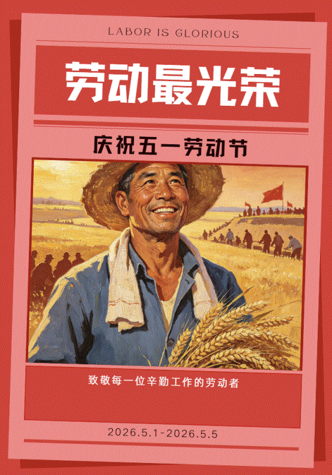

# 海报设计

10 分钟完成热点营销素材全流程。

## 工具链

- **热点拆解**：提取关键词，确定视觉方向
- **AI 生图**：即梦 AI 生成主视觉
- **排版输出**：Canva 调整排版，输出成品

## 适用场景

小红书封面、活动海报、社交媒体营销物料——同一套流程可复用至任何需要快速出图的场景。

## 成品

---

非设计背景，独立完成从创意到成品的全流程。
